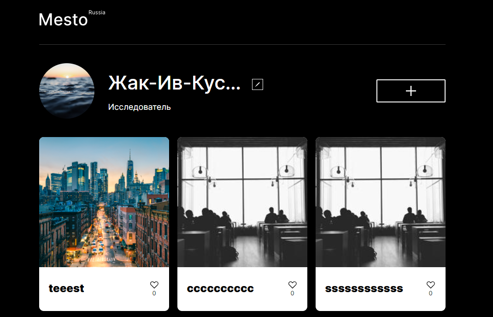

# Проект: Место

## О проекте

Версия проекта Mesto, написанная на нативном JS. Приложение для просмотра чужих и размещения собственных фотографий мест, где Вы были или только хотите побывать.

### Требования к проекту

#### Верстка
✔ внешний вид соответствует макету (реализовано с применением Pixel Perfect)  
✔ файловая структура организована по БЭМ  
✔ приложение адаптировано под экраны разного размера (от 320рх до 1280рх)  
✔ текстовые блоки защищены от переполнения  
✔ модальные окона плавно открываются и закрываются 

#### JS
✔ организация кода в соответствии с ООП (реализация: код разбит на модули, классы симеют приватные и публичные методы, однотипные классы наследуются от одного родителя (модальные окна),  для связи классов используются функции-колбеки, которые передаются в конструктор)  
✔ реализовано редактирование профиля и аватара пользователя, добавление постов, удаление постов с проверкой на владельца, постановка/удаление лайков к постам, просмотр изображений  в полном размере  
✔ поля формы редактирования профиля по умолчанию заполнены значениями со страницы  
✔ данные карточек и пользователя приходят от сервера по запросу, данные форм отправляются на сервер (реализовано через fetch запросы)  
✔ все формы валидируются, при некорректном заполнении полей формы появляются подсказки с текстом ошибки  
✔ модальные окна закрываются кликом на оверлей и нажатием на Esc  
✔ проект собран Webpack

### Стек:
* HTML
* CSS
* JS
* БЭМ
* ООП
* REST API
* Webpack

## Установка зависимостей и запуск проекта

##### `npm i` – установить зависимости

##### `npm run dev` – запуск devServer на http://localhost:3000/

##### `npm run build` – production сборка проекта

Изображения на странице взяты с [сайта](https://unsplash.com) - коллекции бесплатных фотографий.

Макет предоставлен: _Я.Практикум_.

[Ссылка на проект в GH Pages](https://dariy-iva.github.io/mesto/)
